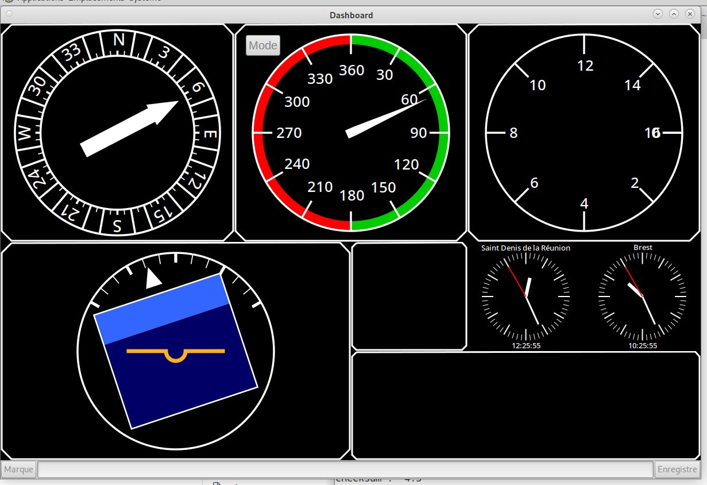

# NauteffVision
## Présentation
Ce logiciel est destiné à l'affichage de données de navigation et à la communication avec le pilote automatique.

<a href="doc/img/Ecran_2024-10-09.png" target="_blank">
  
</a>

## Objectifs du projet
Ce projet a pour objectifs :
  - Aider à la mise au point du pilote automatique ;
  - Fournir au navigateur une visualisation des données de son navire.

## Avancement

Le développement est en cours.
Sa spécification est en partie formalisée.
NauteffVision, en l'état actuel, réalise :
  - l'affichage des données du pilote automatique ;
  - l'enregistrement des données avec horodatage ;
  - l'envoi des commandes au pilote automatique.

L'affichage des données du pilote comprend les valeurs du capteur d'orientation (AHRS) et quelques paramètres ;

## Documentation
Le répertoire doc contient une spécification et de la documentation extraite des sources.

## Installation et utilisation (linux)

### Téléchargement
le téléchargement est fait par git, git doit préalablement être installé.
La commande est la suivante :
```
git clone https://github.com/EmmGautier/NauteffVision
```

Cette commande crée un répertoire NauteffVision, taper alors:
```
cd NauteffVision
```

Il y a plusieurs branches, choisissez la branche flux avec :

```
git checkout Flux
```

Dans le répertoire data créez un tube nommé ("pipe")  avec la commande :

```
mknod  data/tubeNV p
```

Un petit programme de simulation envoie des données vers ce tube, pour l'utiliser taper :

```
sh ./simul.sh &
```

Il est conçu pour s'exécuter en arrière plan, grâce au & en fin de ligne.
Pour voir le programe d'affichage taper :

```
sh ./run.sh
```


